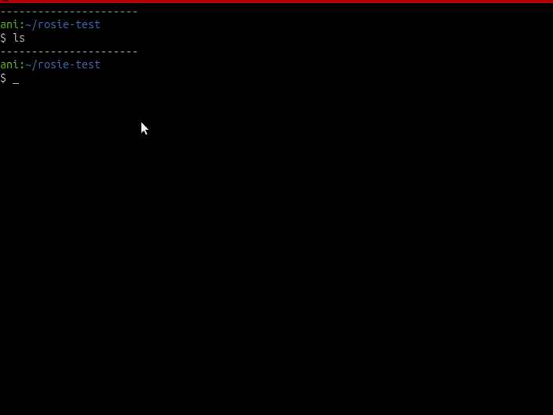

#  ROSIE

> Rosie is the Jetsons' household robot. Rosie does all the housework

CLI for managing your projects' CHANGELOGS.
 
Changelog files created by Rosie (and those which she can deal with) are those which format is based on [Keep a Changelog](https://keepachangelog.com/en/1.0.0/)

## Install

As done with python, the only thing you have to do once you've downloaded Rosie's source code is adding its root directory to your `PATH` environment variabe (or add a symbolic link in `/usr/bin/` that points to Rosie's root directory)

## Commands

To follow [Keep a Changelog](https://keepachangelog.com/en/1.0.0/) standard, Rosie understands the following commands:

 - `add`
 - `change`
 - `deprecate`
 - `remove`
 - `fix`
 - `security`
 
 
 Each of the above includes in the current *Unreleased* section a line with the given message in the specific-change subsection
  
 
 She also understands : 
 
  - `init`: creates a new changelog file (optionally can provide base_tag)
  - `diff`: prints all changes in *Unreleased* section
  - `release <version-number>`: closes the current *Unreleased* tag with the specified **version** and the **current date** ([**](#release-comment))

 
## Demo

 
## Optional Parameters
By default Rosie tries to edit a CHANGELOG.md file in the current directory
 
If you want to change this, she offers the following optional parameters
 
 - `--dir <directory>`
 - `--file <filename>`
  
## Help
 For further help you can always ask her for help with `--help` or `-h`!
 
------
 ** `release` command depends on the project being a git repository (depends on .git/config) for building the compare urls of each version
